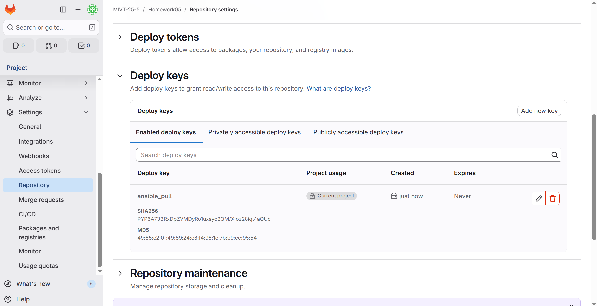

# Отчет по практической работе 5. Оркестрация узлов в Ansible

## На целевой виртуальной машине обеспечить развертывание конфигурации из внешнего репозитория с помощью инструмента ansible-pull.

## 1. Подготовка

```bash
murashovava@node01:~$ sudo mkdir -p /var/opt/ansible
[sudo] password for murashovava: 
murashovava@node01:~$ sudo chown -R $USER:$USER /var/opt/ansible
```

## 2. Регистрация ключа

```bash
murashovava@node01:~$ ssh-keygen -t rsa -b 4096 -C "ansible-pull@192.168.56.66" -f ~/.ssh/id_rsa_ansible_pull
Generating public/private rsa key pair.
Enter passphrase (empty for no passphrase): 
Enter same passphrase again: 
Your identification has been saved in /home/murashovava/.ssh/id_rsa_ansible_pull
Your public key has been saved in /home/murashovava/.ssh/id_rsa_ansible_pull.pub
The key fingerprint is:
SHA256:PYP6A733RxDpZVMDyRo1uxsyc2QM/XIoz28iql4aQUc ansible-pull@192.168.56.66
The key's randomart image is:
+---[RSA 4096]----+
|         E .+=oo.|
|        .  .=+* .|
|       . . .oOo. |
|      . .o o=o.o |
|       oS +++=o  |
|      ..o  o=o+  |
|      .o o   o.  |
|       .* .. ..o |
|      .+o+..o.o  |
+----[SHA256]-----+
```


Выполняем ansible-pull для развертывания конфигурации [docker_swarm.yml](https://gitlab.com/mivt-25-52/homework04/-/blob/main/ansible/docker_swarm.yml?ref_type=heads) из репозитория [Homework04](https://gitlab.com/mivt-25-52/homework04):

```bash
murashovava@node01:~$ ansible-pull   -U https://gitlab.com/mivt-25-52/homework04.git   -d /var/opt/ansible/repo   -i localhost,   --acc
ept-host-key   ansible/docker_swarm.yml
Starting Ansible Pull at 2025-10-31 21:44:16
/usr/bin/ansible-pull -U https://gitlab.com/mivt-25-52/homework04.git -d /var/opt/ansible/repo -i localhost, --accept-host-key ansible/docker_swarm.yml
[WARNING]: Could not match supplied host pattern, ignoring: node01
localhost | SUCCESS => {
    "after": "22e8c324eedc6761ca5e678ad0401f56a7354f5d",
    "ansible_facts": {
        "discovered_interpreter_python": "/usr/bin/python3"
    },
    "before": "22e8c324eedc6761ca5e678ad0401f56a7354f5d",
    "changed": false,
    "remote_url_changed": false
}
[WARNING]: Could not match supplied host pattern, ignoring: node01

PLAY [Установка Docker и настройка Docker Swarm] *******************************

TASK [Gathering Facts] *********************************************************
ok: [localhost]

TASK [Remove conflicting Docker packages] **************************************
ok: [localhost]

TASK [Установить Docker] *******************************************************

TASK [docker_install : Установка необходимых пакетов] **************************
changed: [localhost]

TASK [docker_install : Установка pip для Python 3] *****************************
changed: [localhost]

TASK [docker_install : Установка Docker SDK для Python] ************************
ok: [localhost]

TASK [docker_install : Добавление GPG ключа Docker] ****************************
changed: [localhost]

TASK [docker_install : Добавление репозитория Docker] **************************
changed: [localhost]

TASK [docker_install : Установка пакетов Docker] *******************************
ok: [localhost]

TASK [docker_install : Проверка, запущен ли Docker] ****************************
ok: [localhost]

TASK [docker_install : Убедиться, что группа "docker" существует] **************
ok: [localhost]

TASK [docker_install : Добавить текущего пользователя в группу docker] *********
[WARNING]: Could not match supplied host pattern, ignoring: manager
[WARNING]: Could not match supplied host pattern, ignoring: workers
changed: [localhost]

PLAY [Инициализация Swarm на менеджере] ****************************************
skipping: no hosts matched

PLAY [Присоединение рабочих узлов к Swarm] *************************************
skipping: no hosts matched

PLAY RECAP *********************************************************************
localhost                  : ok=11   changed=5    unreachable=0    failed=0    skipped=0    rescued=0    ignored=0   

```